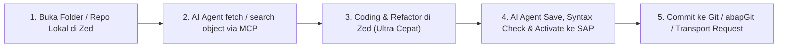

# zed-abap

SAP ABAP language support for [Zed Editor](https://zed.dev).

## Features

- ✅ **Syntax Highlighting** — Full ABAP syntax highlighting via [tree-sitter-abap](https://github.com/kennyhml/tree-sitter-abap)
- ✅ **Code Outline** — Navigate classes, methods, forms, function modules in the Outline panel
- ✅ **Bracket Matching** — Parentheses highlighting
- ✅ **Auto-Indentation** — Smart indentation for block structures
- ✅ **Comment Support** — Line comments (`"`, `*`) and block comments (`/* */`)
- ✅ **AI MCP Ready** — Zero-friction integration with SAP ABAP MCP servers for AI Agents

## Installation

### From Zed Extensions (once published)
1. Open Zed
2. `Cmd+Shift+P` → `zed: extensions`
3. Search for "ABAP"
4. Click Install

### Development / Local Install
1. Clone this repository
2. Open Zed
3. `Cmd+Shift+P` → `zed: install dev extension`
4. Select the `zed-abap` directory

---

## 🚀 Workflow Harian yang Direkomendasikan (Daily Workflow)

Dengan kombinasi **Zed + Tree-sitter ABAP + MCP Server**, workflow development menjadi sangat ringan, modern, dan cepat:



### Langkah-langkah Praktis:

1. **Buka Workspace di Zed (`Cmd + O`)**:
   - Buka folder project ABAP lokal Anda (yang terhubung dengan abapGit atau repositori lokal).
2. **Gunakan Zed AI Assistant (`Cmd + ?`) / Claude Code (`Ctrl + ~`)**:
   - Manfaatkan MCP server untuk mengambil source code langsung dari SAP:
     > *"Tolong cari dan tampilkan method `GET_FLIGHT_DETAILS` dari class `ZCL_FLIGHT_MANAGER`."*
3. **Coding & Refactoring**:
   - Tulis kode ABAP dengan syntax highlighting responsif, auto-closing bracket, dan navigasi outline yang instan.
4. **Syntax Check & Aktivasi ke SAP**:
   - Minta AI Agent untuk melakukan pengecekan syntax dan aktivasi objek di server SAP via MCP (`activate_object` / ATC check).
5. **Versioning**:
   - Lakukan commit perubahan ke Git lokal (`Cmd + Shift + G` di Zed) atau sync ke SAP via abapGit.

---

## ⚡ MCP Integration (AI Agent for SAP)

Tambahkan konfigurasi MCP server ke `~/.config/zed/settings.json` (`Cmd + ,`):

### Option A: Standalone `mcp-abap-adt` (Rekomendasi: Tanpa VS Code)

```json
{
  "context_servers": {
    "abap-adt": {
      "command": {
        "path": "npx",
        "args": ["-y", "mcp-abap-adt"],
        "env": {
          "SAP_URL": "https://your-sap-server.com:44300",
          "SAP_CLIENT": "100",
          "SAP_USER": "YOUR_SAP_USER",
          "SAP_PASSWORD": "YOUR_SAP_PASSWORD"
        }
      }
    }
  }
}
```

### Option B: Via ABAP Remote Filesystem (VS Code bridge)

Jika Anda menjalankan VS Code dengan extension [ABAP Remote Filesystem](https://github.com/marcellourbani/vscode_abap_remote_fs):

1. Koneksikan ke sistem SAP di VS Code
2. Jalankan MCP Server (`Cmd+Shift+P` → "ABAP FS MCP")
3. Tambahkan ke Zed `settings.json`:

```json
{
  "context_servers": {
    "abapfs": {
      "url": "http://localhost:4847/mcp"
    }
  }
}
```

---

## ❓ FAQ & Pertanyaan Umum

### 1. Apakah di SAP ABAP perlu proses compile sebelum deployment?
* **Ya, di SAP istilahnya adalah "Activation" (Aktivasi)**.
* Saat kode ABAP ditulis, statusnya adalah **Inactive**. Agar bisa dijalankan dan masuk ke runtime environment, objek harus di-**Activate** (proses ini sekaligus melakukan kompilasi bytecode/load generation di level application server SAP).
* **Deployment di SAP**: Dilakukan melalui **Transport Request (CTS/TMS)** atau **gCTS (Git-enabled CTS)** pada sistem S/4HANA & BTP.

### 2. Apakah bisa didukung oleh Git Versioning dan Graphify?
* **Git Versioning**: Sangat didukung! Komunitas SAP menggunakan standard **[abapGit](https://abapgit.org)** yang mengekspor objek SAP menjadi file lokal (seperti `.abap`, `.xml` metadata), sehingga Anda bisa melakukan `git commit`, `branch`, dan `PR` langsung dari Zed.
* **Graphify**: Bisa digunakan untuk menganalisis relasi dependensi (CALL FUNCTION, inheritance, interface implementation, database table references) dari file-file ABAP di workspace Anda.

### 3. Bagaimana dengan komponen/package khusus ABAP di macOS?
* Backend ABAP berjalan di **SAP Application Server** (NetWeaver / ABAP Platform), bukan lokal di mesin macOS Anda.
* Karena semua interaksi (baca DDIC table, structure, domain, data element, function module standard/custom) dijembatani lewat **SAP ADT REST API (`/sap/bc/adt/*`)** melalui HTTPS/RFC, seluruh library dan package SAP tetap 100% dapat diakses dari macOS tanpa keterbatasan platform!

---

## File Structure

```
zed-abap/
├── extension.toml              # Extension manifest
├── languages/
│   └── abap/
│       ├── config.toml         # Language configuration
│       ├── highlights.scm      # Syntax highlighting (1100+ rules)
│       ├── outline.scm         # Code structure outline
│       ├── brackets.scm        # Bracket matching
│       ├── indents.scm         # Auto-indentation
│       └── injections.scm      # Embedded language support
├── examples/
│   └── z_sample_abap.abap      # Sample ABAP code
└── README.md
```

## Supported File Extensions

- `.abap`
- `.abap.txt`

## Credits

- Tree-sitter grammar: [kennyhml/tree-sitter-abap](https://github.com/kennyhml/tree-sitter-abap)
- MCP server: [mario-andreschak/mcp-abap-adt](https://github.com/mario-andreschak/mcp-abap-adt)
- Inspired by: [ABAP Remote Filesystem](https://github.com/marcellourbani/vscode_abap_remote_fs)

## License

MIT
