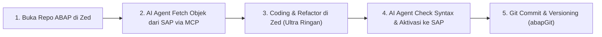

# ⚡ SAP-ABAP Language Support for Zed Editor (`zed-sap-abap`)

[](https://zed.dev)
[](https://www.sap.com)

Ekstensi untuk menghadirkan dukungan bahasa pemrograman **SAP-ABAP** di **[Zed Editor](https://zed.dev)**. Dirancang khusus untuk developer SAP yang menginginkan editor yang **super ringan, ultra responsif (berbasis Rust + GPU Acceleration), dan siap terintegrasi dengan AI Agent (Model Context Protocol / MCP)** sebagai alternatif modern dari SAP GUI / Eclipse ADT.

---

## ✨ Fitur Utama (Features)

- 🎨 **Full Syntax Highlighting** — Mewarnai semua keyword ABAP modern (7.40+, 7.50+, ABAP Cloud, RAP, CDS, Open SQL) menggunakan grammar [tree-sitter-abap](https://github.com/kennyhml/tree-sitter-abap).
- 🌲 **Code Outline Panel** — Navigasi instan ke definisi Class, Interface, Method, Form, Function Module, dan Event block.
- 🔗 **Bracket & Block Matching** — Pencocokan tanda kurung dan struktur logika.
- 📐 **Smart Auto-Indentation** — Indentasi otomatis pada blok `CLASS`, `METHOD`, `IF`, `LOOP`, `TRY`, `SELECT`, dll.
- 💬 **Comment Support** — Komentar baris (`"`, `*`) dan block comment (`/* */`).
- 🤖 **AI MCP Ready** — Terhubung langsung dengan AI Assistant di Zed (Claude / Gemini) untuk membaca dan memanipulasi objek SAP secara langsung.

---

## 📥 Panduan Instalasi (Installation)

### Cara 1: Install dari Zed Extensions (Jika sudah dipublish)
1. Buka Zed Editor.
2. Tekan `Cmd + Shift + P` lalu ketik `zed: extensions`.
3. Cari **SAP-ABAP** lalu klik **Install**.

### Cara 2: Install via Local Development (Dev Extension)
1. Clone repositori ini ke komputer Anda:
   ```bash
   git clone git@github-personal:ghanda-syah/zed-ext-sap-abab.git
   ```
2. Buka **Zed Editor**.
3. Tekan `Cmd + Shift + P` lalu ketik:
   ```text
   zed: install dev extension
   ```
4. Pilih folder repositori `zed-ext-sap-abab` (atau `zed-abap`).

---

## 🚀 Workflow Harian yang Direkomendasikan (Daily Workflow)

Pengembangan SAP-ABAP modern menggunakan Zed memberikan kecepatan luar biasa dibandingkan Eclipse/SAP GUI:



### Langkah Praktis:
1. **Buka Project Lokal (`Cmd + O`)**: Buka folder project ABAP lokal Anda (yang terhubung dengan abapGit).
2. **AI Assistance (`Cmd + ?` atau `Ctrl + ~`)**:
   Minta AI Agent untuk mengambil objek dari SAP:
   > *"Tolong ambil source code class `ZCL_SALES_CONTROLLER` dari sistem SAP."*
3. **Coding & Edit**: Edit kode dengan kecepatan penuh tanpa lag memori.
4. **Aktivasi ke SAP**: Jalankan aktivasi dan pemeriksaan syntax (ATC Check) via MCP tool.
5. **Git Versioning**: Simpan perubahan dengan `git commit` di Zed.

---

## ⚡ Integrasi AI MCP Server (Koneksi ke SAP)

Untuk menghubungkan Zed AI Assistant dengan SAP secara langsung, tambahkan konfigurasi MCP server ke file settings Zed Anda (`~/.config/zed/settings.json` atau via menu `Cmd + ,`):

### 🌟 Pilihan A: Standalone `mcp-abap-adt` (Rekomendasi — Tanpa VS Code)

1. Pastikan Node.js sudah terpasang di komputer Anda.
2. Tambahkan block `context_servers` berikut ke `~/.config/zed/settings.json`:

```json
{
  "context_servers": {
    "abap-adt": {
      "command": {
        "path": "npx",
        "args": ["-y", "mcp-abap-adt"],
        "env": {
          "SAP_URL": "https://your-sap-server.com:44300",
          "SAP_CLIENT": "100",
          "SAP_USER": "YOUR_SAP_USER",
          "SAP_PASSWORD": "YOUR_SAP_PASSWORD"
        }
      }
    }
  }
}
```

### 🌉 Pilihan B: Melalui VS Code Bridge (ABAP Remote Filesystem)

Jika Anda sudah menggunakan extension [ABAP Remote Filesystem](https://github.com/marcellourbani/vscode_abap_remote_fs) di VS Code:
1. Jalankan fitur **ABAP FS MCP Server** di VS Code.
2. Tambahkan ke `settings.json` Zed:
```json
{
  "context_servers": {
    "abapfs": {
      "url": "http://localhost:4847/mcp"
    }
  }
}
```

---

## ❓ Tanya Jawab & Konsep Penting (FAQ)

### 1. Apakah di SAP ABAP perlu compile saat deploy?
* **Ya, istilah resminya adalah Aktivasi (Activation)**.
* Saat kode ditulis, statusnya adalah *Inactive* (draft). Saat Anda menekan *Activate*, sistem SAP akan melakukan pemeriksaan syntax dan mengkompilasi bytecode ke runtime application server.
* Deployment antar server (DEV $\rightarrow$ QAS $\rightarrow$ PRD) menggunakan **Transport Request (CTS)** atau **gCTS (Git-enabled CTS)**.

### 2. Apakah bisa didukung oleh Git Versioning (abapGit) dan Graphify?
* **Sangat bisa!** Standar industri saat ini menggunakan **[abapGit](https://abapgit.org)** yang mengekspor class, report, CDS view, dan tabel SAP ke format file lokal (`.clas.abap`, `.xml`). Anda bisa melakukan branching, commit, dan PR seperti project software modern lainnya.
* **Graphify**: Dapat digunakan untuk memetakan diagram relasi class, method dependencies, dan CDS data model di codebase lokal Anda.

### 3. Bagaimana dengan komponen, library, dan package SAP di macOS?
* **100% Aman & Didukung**. Runtime engine ABAP dan database berjalan di server SAP (Cloud/On-Premise), bukan di komputer lokal macOS.
* Semua akses ke library SAP (`BAPI_*`, standard classes, DDIC structures) dijembatani melalui **SAP ADT REST API (`/sap/bc/adt/*`)** over HTTPS.

---

## 📁 Struktur File Ekstensi (Project Structure)

```text
zed-sap-abap/
├── extension.toml              # Manifest metadata ekstensi Zed
├── grammars/
│   └── abap.wasm               # Compiled Tree-sitter WebAssembly parser
├── languages/
│   └── abap/
│       ├── config.toml         # Konfigurasi bahasa (SAP-ABAP) & komentar
│       ├── highlights.scm      # 1100+ baris aturan syntax highlighting
│       ├── outline.scm         # Aturan navigasi struktur kode
│       ├── brackets.scm        # Bracket matching rules
│       ├── indents.scm         # Aturan auto-indentasi
│       └── injections.scm      # Dukungan embedded SQL/string
├── examples/
│   └── z_sample_abap.abap      # Contoh kode program ABAP untuk testing
└── README.md                   # Dokumentasi lengkap
```

## 📄 File Extension yang Didukung

- `.abap`
- `.abap.txt`

---

## 🤝 Credits

- Tree-sitter grammar: [kennyhml/tree-sitter-abap](https://github.com/kennyhml/tree-sitter-abap)
- MCP server: [mario-andreschak/mcp-abap-adt](https://github.com/mario-andreschak/mcp-abap-adt)
- Inspirasi arsitektur: [ABAP Remote Filesystem (Marcello Urbani)](https://github.com/marcellourbani/vscode_abap_remote_fs)
