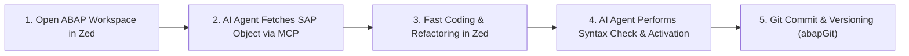
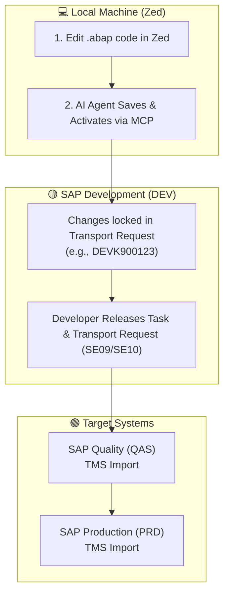
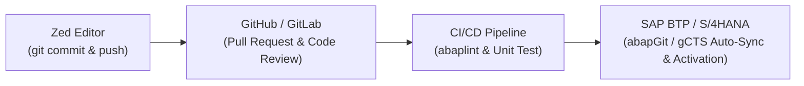

# ⚡ SAP-ABAP Language Support for Zed Editor (`zed-sap-abap`)

[](https://zed.dev)
[](https://www.sap.com)
[](https://microsoft.github.io/debug-adapter-protocol/)
[](https://modelcontextprotocol.io)

Comprehensive **SAP-ABAP** language support and debugging toolkit for the **[Zed Editor](https://zed.dev)**. Tailored for SAP developers seeking an ultra-lightweight, blazing-fast (Rust + GPU-accelerated), and AI-augmented coding environment as a modern alternative to heavy IDEs.

---

## ✨ Features

- 🎨 **Full Modern Syntax Highlighting** — Rich syntax coloring for modern ABAP (7.40+, 7.50+, ABAP Cloud, RAP, CDS Views, and Open SQL) powered by [tree-sitter-abap](https://github.com/kennyhml/tree-sitter-abap).
- 🌲 **Code Outline Navigation** — Instant structural jumping to Classes, Interfaces, Methods, Form routines, Function Modules, and Event blocks.
- 🔗 **Bracket & Structure Matching** — Precise highlighting of paired parentheses, control blocks, and logical closures.
- 📐 **Smart Auto-Indentation** — Intelligent indent rules for `CLASS`, `METHOD`, `IF`, `LOOP`, `TRY`, `SELECT`, and other block constructs.
- 💬 **Complete Comment Support** — Full recognition of line comments (`"`, `*`) and block comments (`/* */`).
- 🐛 **Interactive DAP Debugger** — Built-in Debug Adapter Protocol (DAP) server supporting breakpoints, step-by-step execution, and variable inspection.
- 🤖 **AI MCP Ready** — Native integration with Zed AI Assistant (Claude / Gemini) via Model Context Protocol to inspect, generate, and manipulate live SAP objects.

---

## 📥 Installation

### Method 1: Local Development Installation (Dev Extension)

1. Clone this repository to your local machine:
   ```bash
   git clone git@github-personal:ghanda-syah/zed-ext-sap-abab.git
   ```
2. Open **Zed Editor**.
3. Press `Cmd + Shift + P` (macOS) or `Ctrl + Shift + P` (Linux) and type:
   ```text
   zed: install dev extension
   ```
4. Select the `zed-ext-sap-abab` (or `zed-abap`) directory.

### Method 2: From Zed Extension Registry (Once Published)

1. Open Zed Editor.
2. Press `Cmd + Shift + P` and search for `zed: extensions`.
3. Search for **SAP-ABAP** and click **Install**.

---

## 🚀 Recommended Daily Workflow

Developing SAP-ABAP in Zed delivers an instantaneous, zero-lag experience compared to traditional environments:



### Step-by-Step Guide:
1. **Open Workspace (`Cmd + O`)**: Open your local ABAP project directory (synchronized with abapGit).
2. **AI Agent Interaction (`Cmd + ?` or `Ctrl + ~`)**:
   Ask your AI Assistant to fetch or query live SAP objects:
   > *"Retrieve the source code for class `ZCL_SALES_CONTROLLER` from the SAP development server."*
3. **Coding & Refactoring**: Enjoy instant keystroke response, syntax highlighting, and outline navigation.
4. **Syntax Check & Activation**: Trigger syntax verification (ATC checks) and activation directly through MCP tools.
5. **Version Control**: Commit clean, modular changes to Git within Zed.

---

## 🐛 Interactive Debugging with DAP (Debug Adapter Protocol)

`zed-sap-abap` includes a built-in DAP server (`dap/abap-dap-server.js`) that connects Zed's native debugging interface directly to SAP ADT Debugger REST APIs (`/sap/bc/adt/debugger/*`).

### Debug Configuration

Create or update your debug configuration in `.zed/settings.json` or `.zed/tasks.json`:

```json
{
  "debug": {
    "adapter": "sap-abap",
    "request": "launch",
    "sapUrl": "https://your-sap-server.com:44300",
    "client": "100",
    "user": "YOUR_SAP_USER",
    "password": "YOUR_SAP_PASSWORD",
    "stopOnEntry": false
  }
}
```

### Debugging Capabilities:
- 🔴 **Breakpoints**: Click the editor margin to place line breakpoints in `.abap` files.
- ⏭️ **Step Over (`F6`) / Step Into (`F5`) / Step Return (`F7`)**: Navigate statement execution step by step.
- 🔍 **Variable Inspection**: Inspect local variables, global tables, and SAP system fields (`SY-SUBRC`, `SY-TABIX`, `SY-UNAME`, `SY-DATUM`, `SY-UZEIT`).

---

## ⚡ AI MCP Server Integration (Connecting to SAP)

To enable live SAP communication for Zed's built-in AI Assistant, add the MCP server configuration to your Zed `settings.json` (`~/.config/zed/settings.json` or `Cmd + ,`):

### Option A: Standalone `mcp-abap-adt` (Recommended — No VS Code Needed)

```json
{
  "context_servers": {
    "abap-adt": {
      "command": {
        "path": "npx",
        "args": ["-y", "mcp-abap-adt"],
        "env": {
          "SAP_URL": "https://your-sap-server.com:44300",
          "SAP_CLIENT": "100",
          "SAP_USER": "YOUR_SAP_USER",
          "SAP_PASSWORD": "YOUR_SAP_PASSWORD"
        }
      }
    }
  }
}
```

### Option B: Via ABAP Remote Filesystem (VS Code Bridge)

If you have [ABAP Remote Filesystem](https://github.com/marcellourbani/vscode_abap_remote_fs) running in VS Code:

1. Enable the MCP toggle in VS Code.
2. Add the following to Zed `settings.json`:
```json
{
  "context_servers": {
    "abapfs": {
      "url": "http://localhost:4847/mcp"
    }
  }
}
```

---

## 🚢 SAP ABAP Deployment Guide

In the SAP ecosystem, deployment is governed by **Activation** and the **Transport System**:

### 🏢 Method 1: Enterprise Transport Request (CTS / TMS)

Standard deployment lifecycle for On-Premise and S/4HANA Private Cloud:



1. **Develop in Zed**: Write and refine ABAP routines locally.
2. **Save & Activate**: Code is pushed to SAP DEV and recorded into an assigned **Transport Request (TR)**.
3. **Release TR**: Release the task and transport request in SAP (`SE09` / `SE10`).
4. **Import to QAS/PRD**: Transport Management System (TMS) imports the TR into Quality and Production environments.

---

### 🌐 Method 2: Modern GitOps — CI/CD via abapGit / gCTS

Targeted for ABAP Cloud, SAP BTP, and open-source repositories:



1. **Git Commit in Zed**: Commit modular changes to your local branch.
2. **Pull Request**: Submit PR on GitHub/GitLab for team review.
3. **Automated CI**: GitHub Actions executes `abaplint` static analysis and automated unit tests.
4. **Deploy & Activate**: On merge to `main`, **abapGit** or **gCTS** synchronizes changes directly into the target SAP environment.

---

## ❓ Frequently Asked Questions (FAQ)

### 1. Does ABAP require compilation before deployment?
* **Yes, in SAP this is called Activation**.
* Unactivated code remains in an *Inactive* draft state. The activation step validates syntax and compiles the source code into executable bytecode on the SAP Application Server.

### 2. Can I use Git Versioning (abapGit) and Graphify with Zed?
* **Absolutely**. [abapGit](https://abapgit.org) exports SAP repository objects into standard local files (`.clas.abap`, `.xml`). You can branch, diff, merge, and pull request directly in Zed.
* **Graphify**: Seamlessly analyzes dependencies, class inheritances, method invocations, and CDS data models across your workspace files.

### 3. Are custom SAP packages and DDIC components supported on macOS?
* **100% Supported**. The ABAP runtime and database live on the remote SAP server, not locally on macOS. All communication with SAP libraries (`BAPI_*`, standard classes, DDIC tables/structures) occurs through the standard **SAP ADT REST API (`/sap/bc/adt/*`)** over HTTPS.

---

## 📁 Project Structure

```text
zed-sap-abap/
├── extension.toml                      # Zed extension manifest
├── debug_adapter_schemas/
│   └── sap-abap.json                   # DAP configuration JSON schema
├── dap/
│   └── abap-dap-server.js              # Standalone Node.js DAP debug server
├── grammars/
│   └── abap.wasm                       # Compiled Tree-sitter WebAssembly parser
├── languages/
│   └── abap/
│       ├── config.toml                 # Language configuration (SAP-ABAP)
│       ├── highlights.scm              # 1,100+ syntax highlighting rules
│       ├── outline.scm                 # Code structure navigation queries
│       ├── brackets.scm                # Bracket matching definitions
│       ├── indents.scm                 # Auto-indentation patterns
│       └── injections.scm              # Embedded SQL & template support
├── examples/
│   └── z_sample_abap.abap              # Complete sample ABAP program
└── README.md                           # Documentation
```

## 📄 Supported File Extensions

- `.abap`
- `.abap.txt`

---

## 🤝 Credits & Acknowledgments

- Tree-sitter grammar: [kennyhml/tree-sitter-abap](https://github.com/kennyhml/tree-sitter-abap)
- Standalone MCP server: [mario-andreschak/mcp-abap-adt](https://github.com/mario-andreschak/mcp-abap-adt)
- Architecture Inspiration: [ABAP Remote Filesystem (Marcello Urbani)](https://github.com/marcellourbani/vscode_abap_remote_fs)
